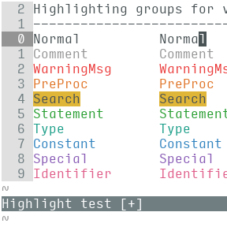
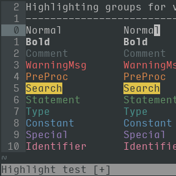

# vrunchbang

A vim theme inspired by the [CrunchBang](https://distrowatch.com/table.php?distribution=crunchbang) Linux distribution (now [BunsenLabs](https://www.bunsenlabs.org/)).

## screenshots

<table>
<tr></tr><tr><td align="center"><strong>vrunchbang-<br>light</strong></td>
<td align="center"> </td>
<td align="center"><strong>vrunchbang-<br>dark</strong></td></tr>
</table>

## installation

### step 1: download the colour scheme

#### option A: manually

Download the [colourscheme files](https://github.com/nightsense/vrunchbang/tree/master/colors) and place in directory `~/.vim/colors/` (Linux/Mac) or `%userprofile%\vimfiles\colors\` (Windows).

#### option B: using a plugin manager

For easy management of Vim colour schemes (and other plugins), try a plugin manager. With [vim-plug](https://github.com/junegunn/vim-plug), for instance, just add `Plug 'nightsense/vrunchbang'` to the list of plugins in your `vimrc`, then run `PlugUpdate`.

### step 2: activate the colour scheme

To activate the vrunchbang theme, add one of the following lines to your `vimrc`:

- `colorscheme vrunchbang-light`
- `colorscheme vrunchbang-dark`

To assign themes to specific intervals of the day, try the [night-and-day](https://github.com/nightsense/night-and-day) plugin.

## terminal vim

To make this theme work in terminal vim, install [nightshell](https://github.com/nightsense/nightshell) to `~/.nightshell`:

```
git clone https://github.com/nightsense/nightshell ~/.nightshell
```

## notes

This theme was created using Chris Kempson's [base16](https://github.com/chriskempson/base16-vim) as a template.
